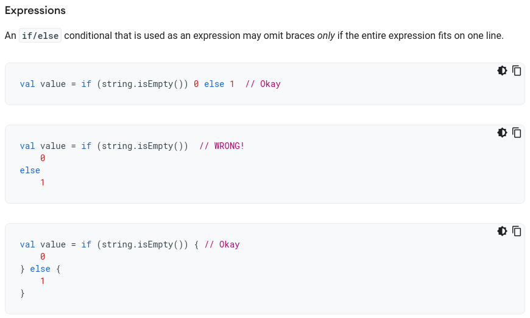

# Kotlinのifを愛でる
okuzawats
明日思わず誰かに伝えたくなる話
2022/03/11
converted to markdown format 2022/05/29

<!--
_class: lead
_paginate: false
_header: ""
-->

## 自己紹介

- 奥澤（@okuzawats）
- Androidアプリエンジニア＠フラー株式会社
- テックリード
- 「Jetpack ComposeによるAndroid MVVMアーキテクチャ入門」の著者


## 今夜のトピックス

1. 自己紹介
2. なんでKotlinのifを愛でるのか
3. Coding Conventions
4. 事例
5. NG例
6. まとめ

## なんでKotlinのifを愛でるのか

ifは最も基本的なプログラムの構成要素

- ifに思い入れを持ってプログラムを書くことで、他のところもいい感じに書けるようになる（かもしれない）
- 逆に言うと、ifすら蔑ろにすると他のところも残念なことになりそう（偏見）
- **Coding conventionsを読む習慣を付ける**

## Coding Conventions

- Kotlin公式のCoding conventions
  - https://kotlinlang.org/docs/coding-conventions.html
- AndroidのKotlin style guide
  - https://developer.android.com/kotlin/style-guide

## ifに関するCoding conventions

AndroidのKotlin style guideには以下の記載がある



## ifに関するCoding conventions

つまり、

```kotlin
if (42 == 42) true else false
```

みたいに一行に収まる（三項演算子みたいな）if-elseか、

```kotlin
if (42 == 42) {
  true
} else {
  false
}
```

みたいにブロックを書くかのどちらか。

##

Kotlin公式のCoding conventionsには明確に書かれてないけどサンプルコードに示されるif-elseはこのスタイルで書かれている

##

ここまでが前置きで、これを踏まえて愛でていきます。

## example.1 ひとつひとつreturnを書く

```kotlin
// Javaを書いてた人とかが最初に書きそうなコード
fun awesomeFunction1(value: Int): String {
  if (value == 42) {
    return "answer"
  } else {
    return "oops"
  }
}
```

## example.1 ひとつひとつreturnを書く

寸評

- 古き良き書き方実家のような安心感だが、IDEに怒られるのが玉に瑕。
- Kotlinのifは値を返す式なので、ifを返せば良い。その方がKotlinらしいコードになる（と思う）。


## example.2 ifをreturnする

```kotlin
// Kotlinのifは値を返す式なので、こう書けるし、こう書いたほうがKotlinらしい
fun awesomeFunction2(value: Int): String {
  return if (value == 42) {
    "answer"
  } else {
    "oops"
  }
}
```

## example.2 ifをreturnする

寸評

- 直接if-elseの評価結果を返すので、どんな値がreturnされるのかがわかりやすい。
- returnの前に早期リターンすることは可能なので、単にif-elseだけ見ていれば良いというわけではないのが玉に瑕。
- example.1よりもKotlinらしいコードになった（と思う）。

## example.3 ブロックを省略する

```kotlin
// if-elseのブロックは省略できる
fun awesomeFunction3(value: Int): String {
  return if (value == 42) "answer" else "oops"
}
```

## example.3 ブロックを省略する

寸評

- Kotlin style guideに書かれている書き方（ただし一行に収まる場合）。三項演算子の代わりに使えてしまう。
- Kotlinらしい書き方だけど、一行が長くなると改行が欲しくなり、ブロックを足さないといけなくなるのが玉に瑕。

## example.4 関数本体を返す

```kotlin
// 関数本体を直接返す
fun awesomeFunction4(value: Int): String =
  if (value == 42) {
    "answer"
  } else {
    "oops"
  }
}
```

```kotlin
// 関数本体を直接返す
fun awesomeFunction4r(value: Int): String =
  if (value == 42) "answer" else "oops"
```

## example.4 関数本体を返す

寸評

- 早期リターンなどが発生し得ない書き方。
- if-elseの評価結果が返されるので、どんな値が返されるのかは一目瞭然。
- 個人的には好き。
- 行数が少なくなって人類が幸せになる。

## example.5 Scalaでみる書き方

```kotlin
// Scalaっぽい
fun awesomeFunction5(value: Int): String =
  if (value == 42) "answer"
  else "oops"
```

## example.5 Scalaでみる書き方

寸評

- Scalaだとこういう書き方をする気がする（Scalaというか関数型言語？）
- 個人的にはこの書き方が一番好きだけど、チーム開発だと推しにくい。
- example.3、example.4くらいがちょうどいいかもしれない。
- 書籍Functional Programming Kotlinではこの書き方をしているので、関数型に馴染みがあるとこういう書き方を好むのかもしれない。

## NG例

## NG1 ブロック省略＆改行あり

```kotlin
fun notAwesomeFunction1(value: Int): String {
  return if (value == 42)
    "answer"
  else
    "oops"
}
```

## NG1 ブロック省略＆改行あり

寸評

- Kotlin style guide違反。
- 何で違反になっているかはわからない:thinking:
  - Dangling else？

## NG2 ifとelseが非対称

```kotlin
fun notAwesomeFunction2(value: Int): String {
  return if (value == 42)
    "answer"
  else throw IllegalArgumentException("no answer")
}
```

## NG2 ifとelseが非対称

寸評

- 個人的にはNG。if-elseが非対称なので目が滑る。
- if-elseを対象的に（同じ書き方で）書きたい。

## 発表時間の都合で以下略

- 処理の途中でifを使って副作用のあるコードを実行するパターン
- 早期リターンするパターン

## まとめ

- Kotlinはifだけ見ても色々な書き方ができる。
- Kotlinの言語機能を活かした、Kotlinらしいコードが書けると読みやすいコードになると思う。
- 自分たちだけの最強のifを見つけよう！
