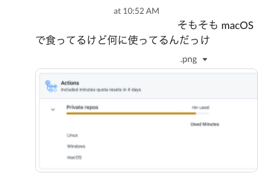
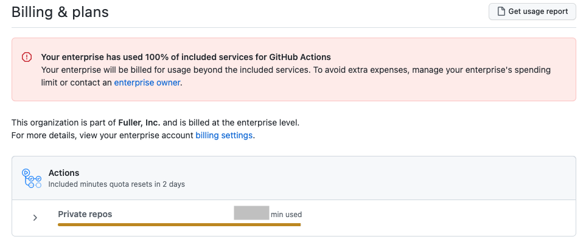
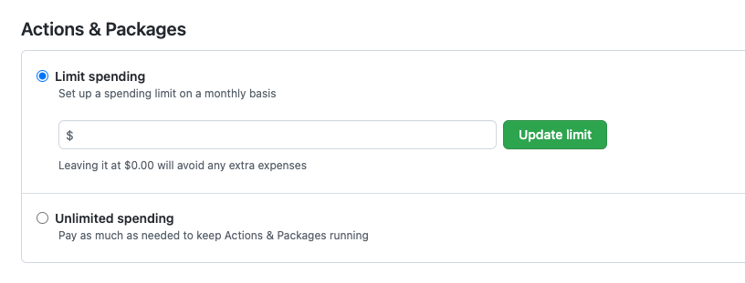
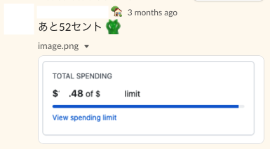

# GitHub ActionsでAndroidアプリのテストを回しまくってたら全プロジェクトのCI/CDが完全停止する寸前だった件

<!--
_class: lead
_paginate: false
_header: ""
-->

## 自己紹介

okuzawats
フラー株式会社
ソフトウェアエンジニア（Android）


## 今日話すことの要約

GitHub Actions上で無計画にテストを回しまくってたら会社のGitHubが完全停止する寸前でした😇

そんなことにならないよう、計画的にGitHub Actionsを回しましょう😊

## 前提知識

会社で契約しているGitHub Enterpriseは、月あたり使える時間の上限（単位：分/月）が決まっている。

上限を超えるとGitHub Actionsが完全に止まってしまう（らしい）。

※プランによるのかもしれない

## 事件の数日前

##



## 暫定対策

macOS上で動いているGitHub Actionsのトリガーが走る頻度を落とす。

macOS上で動いているGitHub Actionsを完全停止させるわけにはいかないので、頻度を落として様子を見よう、という判断。

## 事件当日

## ダメでした

頻度は少なくなってもmacOS上で動いている子と、それ以外のOS上でも動いている子たちがモリモリとGitHub Actionsの残りを食べ尽くしました。

##



##

*Your enterprice has used 100% of included services for GitHub Actions.*

## 100%中の100%!!!

偉い人が追加でGitHubに課金してくれて、GitHub Actionsの枠を一時的に増強💪

会社のCI/CDが完全停止する事態を回避🎉

##



## 🎉

## やっぱりダメでした

##



## 

なんやかんやあってGitHub Actionsの完全停止は回避しました。

## 何が起こったのか

## エミュレータテスト on GitHub Actions

昨年秋から、担当しているAndroidアプリにおいて、GitHub Actions上でエミュレータを用いた自動テストを回し始めた。

## 実行頻度

Pull Request作成時やdevelopブランチへのpush時などにテストを実行していた。

普段は大きな開発がないプロジェクトなので、月あたりのエミュレータテストの実行回数はさほど多くなかった。

## macOSインスタンス

GitHub Actions上でAndroidのエミュレータを実行する場合、macOSインスタンスの使用が推奨されている。

GitHub Actions上でmacOSを動かすと、Ubuntuの場合の10倍の速さでGitHub Actionsの使用枠を消費する。

## 普段は問題なかった

普段は大きな開発がないため、月あたりのエミュレータテストの実行回数はさほど多くなかった。

定期的にGitHubの管理者に確認して、上限まで余裕があることを確認していた:ok_man:

## 問題がある時もあった

ある機能を開発する時、エミュレータテストの実行回数が普段よりも大幅に増えた。

そのためGitHub Actionsの使用量が増加し、簡単に上限に達した。

## 原因①

macOS上で動くGitHub Actionsがトリガーされる頻度が一時的に高くなることで問題が発生する可能性を考慮せず、普段よりも大きな規模の開発に入ってしまった。

## 原因②

普段からGitHub Actionsの使用量をモニタリングする習慣がなかった。

## 原因③

GitHub Actionsの消費量はリアルタイムにモニタリングできないので、様子を見ている間に対応が後手に回ってしまった。

## 対策① 1日1回の定時実行に変更

コストの高いmacOS上での実行頻度を見直しました。

こういうやつです（※実際の設定とは異なります）

```yaml
on:
  schedule:
    - cron: '30 5 * * 1,3'
    - cron: '30 5 * * 2,4'
```

## 対策② 定期的なモニタリング

定期的に実施されるMTG上で、GitHub Actionsの消費量を確認するようにしました。

## まとめ

- GitHub Actions上でAndroidのInstrumented Testを、macOS上で無計画に動かしてしまった。
- macOS上でGitHub Actionsを動かすのは高コストなので、無計画に回すとGitHub Actionsの枠を簡単に喰い潰す。
- ご利用は計画的に👼
